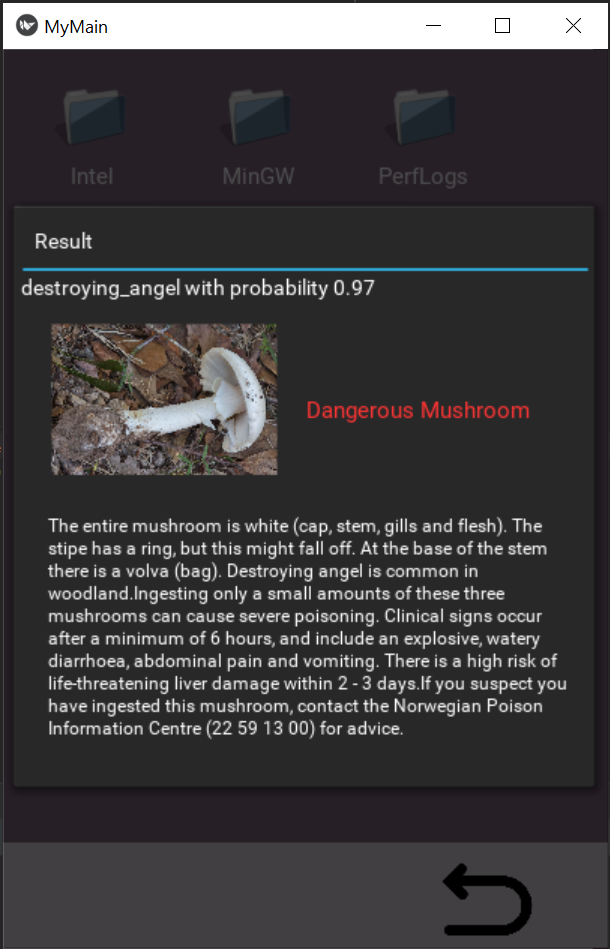

# Seba
Trying to move my Personal project about predicting poisonous mushrooms (using Convultional Neural Networks) in Oslo to 
Android  mobile app using Kivy. 

[Link to the Project](https://github.com/sebalp1987/mushroom_identify)

## [Unreleased]
### Added
### Changed
### Removed

## [0.0.1] - 2018-02-26
### Added
### Removed
### Changed
### Fixed
### Deprecated
### Security

## Authors

* **Sebastián Mauricio Palacio**